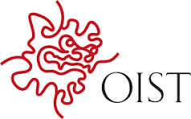
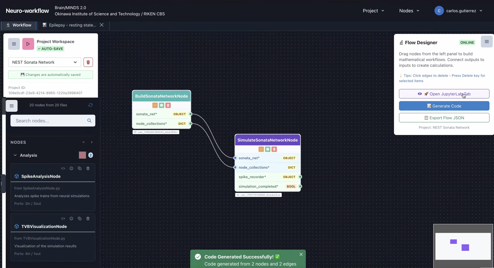
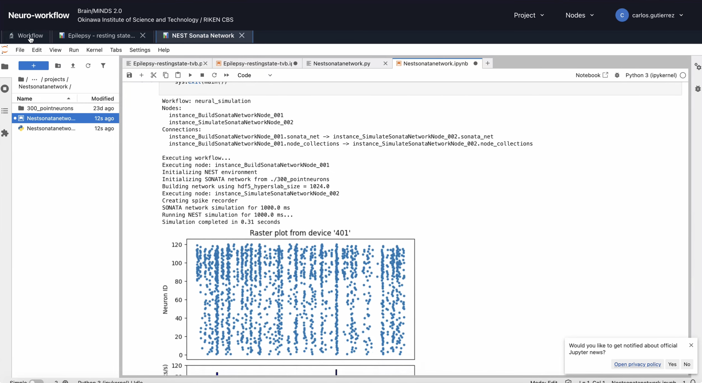
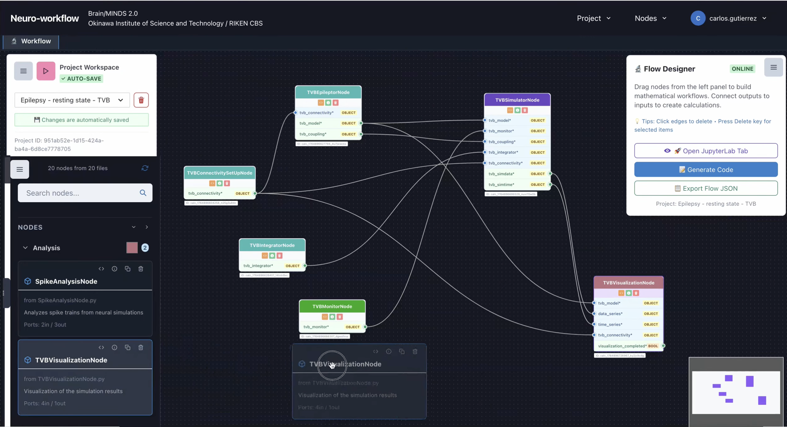

# NeuroWorkflow

A Python library for building and executing neural simulation workflows.

## Support and Development

### Supported by Brain/MINDS 2.0

### Developed by Neural Computation Unit (Doya Lab) at OIST and Collaborators

This project is supported by the **<a href="https://brainminds.jp/" target="_blank">Brain/MINDS 2.0</a>** initiative and is being developed by the **<a href="https://www.oist.jp/research/research-units/ncu" target="_blank">Neural Computation Unit (Doya Lab)</a>** at the **Okinawa Institute of Science and Technology (OIST)** in collaboration with partners.

## Preview

Get a first impression of NeuroWorkflow in action:

  

<a href="https://youtu.be/hC4NUOuR3OI?si=VwYyRLDbtXGk6RiF" target="_blank">🎥 Watch the full NeuroWorkflow demonstration video</a>

## Current Status

### NeuroWorkflow Python API

NeuroWorkflow provides a comprehensive Python API for building and executing computational neuroscience workflows using a node-based system. The core functionality is organized as follows:

#### Node System
- **Node Storage**: All available nodes are stored in `src/neuroworkflow/nodes/`
- **Organization**: Nodes are organized in customizable categories for easy navigation
- **Extensibility**: New custom nodes can be created and integrated into the system

#### Creating Custom Nodes
For developers interested in extending NeuroWorkflow with custom functionality:

- **📋 Node Schema**: See `NODE_SCHEMA.md` for detailed node structure specifications
- **📝 Template**: Use `CustomNodeTemplate.py` as a starting point for new nodes
- **📖 Tutorial**: Follow `CUSTOM_NODE_TUTORIAL.md` for step-by-step node creation guide

#### Python API Examples
The following examples demonstrate how to use the NeuroWorkflow Python API to create and execute workflows:

**Examples folder:**
- `sonata_simulation.py` - Basic simulation example
- `neuron_optimization.py` - Parameter optimization example (in development)
- `epilepsy_rs.py` - Epileptic resting state simulation using The Virtual Brain (TVB)

**Notebooks folder:**
- `01_Basic_Simulation.ipynb` - Interactive basic simulation tutorial
- `epilepsy_rs.ipynb` - Interactive epileptic resting state example with TVB
- `SNNbuilder_example1.ipynb` - Spiking Neural Network building with SNNbuilder custom nodes

### NeuroWorkflow Web Application

For users who prefer a graphical interface, NeuroWorkflow includes a comprehensive web application that provides visual workflow building capabilities.

#### Installation
To set up the web application, follow the detailed instructions in `gui/README.md`.

#### Important Setup Notes

**Node Synchronization:**
- The web app requires nodes to be copied from `src/neuroworkflow/nodes/` to `gui/workflow_backend/django-project/codes/nodes/`
- This copy is regularly performed by administrators
- **For developers**: If you create new custom nodes, ensure they are copied to the web app directory to make them available in the GUI

**Core API Synchronization:**
- The Python API base code from `src/neuroworkflow/core/` is also copied to the web application
- Web app location: `gui/workflow_backend/django-project/codes/neuroworkflow/core/`
- This ensures the web app stays synchronized with the latest API updates

## Conference Presentations

This work has been presented at several conferences and workshops, receiving valuable feedback that has contributed to its ongoing development:

### 2025

- **Winter Workshop**

  - _"Towards a Generic and Open Software for Building Digital Brains"_
  - [📄 Poster](posters_conferences/Winter_WorkShop_BM2.pdf)

- **Unified Theory Workshop** (May 30, 2025)

  - _"NeuroWorkflow: A python-based Graph Framework for Modular Brain Modeling Workflows"_
  - [📄 Poster](posters_conferences/Unified_Theory_Poster_2025May30.pdf)

- **NEST Conference 2025** (June 17, 2025)

  - _"A Graph-Based, In-Memory Workflow Library for Brain/MINDS 2.0"_
  - [📄 Presentation Slides](posters_conferences/NEST_conference_slides_20250617_Carlos.pdf)

- **CNS 2025 (Computational Neuroscience Society)**

  - _"A Graph-Based, In-Memory Workflow Library for Brain/MINDS 2.0 – The Japan Digital Brain Project"_
  - [📄 Poster](posters_conferences/Poster_cns2025_Carlos.pdf)

- **RIKEN CBS Hackathon** (September 28, 2025)

  - _"Building BrainModeling Workflows: A proof-of-concept framework"_
  - [📄 Hackathon Material](posters_conferences/hackathon_material_OIST_carlos_20250928.pdf)

- **INCF/EBrains Summit**
  - _"NeuroWorkflow: A Node-Based Framework for Scalable Computational Neuroscience with AI-Ready Infrastructure"_
  - [📄 Abstract](posters_conferences/abstract_INCF_EBrains_summit.pdf)

## License

This project is licensed under the MIT License - see the LICENSE file for details.
